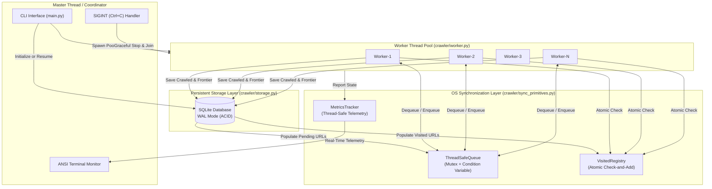

# Multi-Threaded Web Crawler (Operating Systems Course Project)

A high-performance, concurrent, and resumable web crawler designed to demonstrate foundational **Operating Systems (OS) concurrency and synchronization principles**.

---

## 📋 Table of Contents
- [Project Overview](#-project-overview)
- [Key Operating Systems Concepts](#-key-operating-systems-concepts)
- [System Architecture](#-system-architecture)
- [Synchronization Primitives & Concurrency Model](#-synchronization-primitives--concurrency-model)
  - [1. Producer-Consumer Pattern (`ThreadSafeQueue`)](#1-producer-consumer-pattern-threadsafequeue)
  - [2. Preventing Check-Then-Act Race Conditions (`VisitedRegistry`)](#2-preventing-check-then-act-race-conditions-visitedregistry)
  - [3. Resource Allocation & Overshoot Prevention](#3-resource-allocation--overshoot-prevention)
  - [4. Deadlock Avoidance & Termination Detection](#4-deadlock-avoidance--termination-detection)
- [State Persistence & Fault Tolerance (Resume Engine)](#-state-persistence--fault-tolerance-resume-engine)
- [Project Structure](#-project-structure)
- [Installation & Quickstart](#-installation--quickstart)
- [CLI Reference](#-cli-reference)
- [Live Terminal Dashboard](#-live-terminal-dashboard)
- [Verification & Testing Suite](#-verification--testing-suite)

---

## 🔍 Project Overview

In traditional single-threaded web crawlers, HTTP requests block the entire execution pipeline while waiting on network I/O. This project implements a **Multi-Threaded Worker Pool** that crawls websites concurrently, utilizing CPU and network resources efficiently while managing shared access to:
1. **The Shared URL Frontier Queue**
2. **The Visited URL Registry**
3. **The Persistent Disk Storage (SQLite with Write-Ahead Logging)**
4. **Live Telemetry & Metrics Counters**

A standout capability of this crawler is **Crash Resilience and Resumability**:
If interrupted by the user (`Ctrl+C` / `SIGINT`) or paused, the crawler captures state atomically. When restarted with `--resume`, it picks up exactly where it stopped without re-crawling visited pages.

---

## 🧠 Key Operating Systems Concepts

| Operating Systems Concept | Implementation Details |
| :--- | :--- |
| **Multithreading & Thread Lifecycle** | Fixed worker pool model (`WorkerThread`), master coordinator thread, thread spawning, synchronization, and synchronized termination (`join`). |
| **Shared Resources & Critical Sections** | The frontier queue and visited registry are shared across all worker threads; critical sections are strictly guarded via mutual exclusion. |
| **Mutual Exclusion (Mutex)** | `threading.Lock` protects queues, registries, metrics, and SQLite database commits from race conditions and data corruption. |
| **Condition Variables & Signaling** | `threading.Condition` coordinates worker waiting (`wait()`) when the frontier queue is empty and signals waiting workers (`notify()`, `notify_all()`) when new URLs are discovered. |
| **Producer-Consumer Architecture** | Workers dynamically alternate between consumers (dequeueing pending URLs) and producers (extracting and enqueueing newly discovered child links). |
| **Race-Condition Prevention** | Custom `VisitedRegistry.check_and_add()` performs an atomic check-and-insert operation, preventing multiple threads from concurrently crawling the same URL. |
| **Counting Semaphores / Slots** | `MetricsTracker.try_reserve_page_slot()` acts as a counting semaphore to strictly bound total pages crawled to `max_pages` without worker overshooting. |
| **Deadlock Avoidance & Termination** | Bounded timeouts, non-cyclic lock acquisition order, and explicit termination condition: `frontier.empty() AND active_workers == 0 AND unfinished_tasks == 0`. |
| **Asynchronous I/O Scheduling** | Demonstrates how the OS scheduler interleaves CPU-bound HTML parsing and I/O-bound network socket requests across multiple kernel/user threads. |
| **State Persistence & ACID Transactions** | Uses SQLite in **WAL mode (Write-Ahead Logging)** for fast, thread-safe, crash-resilient disk state snapshots. |

---

## 🏛 System Architecture



---

## ⚙️ Synchronization Primitives & Concurrency Model

### 1. Producer-Consumer Pattern (`ThreadSafeQueue`)
Implemented in `crawler/sync_primitives.py` using Python's primitive `threading.Lock` and `threading.Condition`:
- **`put(item)`**: Acquires the mutex lock, appends the URL to an internal `collections.deque`, increments `_unfinished_tasks`, and signals waiting threads via `_not_empty.notify()`.
- **`get(timeout)`**: Acquires the mutex lock. While the queue is empty and shutdown is not set, invokes `_not_empty.wait(timeout)`. This puts the worker thread into a low-overhead OS waiting state rather than spinning in a busy-wait loop.
- **`shutdown()`**: Broadcasts `_not_empty.notify_all()` to cleanly wake up all waiting threads when terminating or pausing.

### 2. Preventing Check-Then-Act Race Conditions (`VisitedRegistry`)
A common concurrency bug in naive crawlers is the "check-then-act" race:
```python
# BUGGY NAIVE CODE:
if url not in visited:
    # Context switch can occur here! Another thread checks and also enters!
    visited.add(url)
    crawl(url)  # Both threads fetch the exact same URL twice!
```
Our `VisitedRegistry.check_and_add(url)` wraps this in a strict critical section:
```python
def check_and_add(self, url: str) -> bool:
    with self._lock:
        if url in self._visited:
            return False
        self._visited.add(url)
        return True
```
This guarantees that across $N$ threads attempting to process the same link, exactly one succeeds and the other $N-1$ discard it immediately.

### 3. Resource Allocation & Overshoot Prevention
When multiple threads execute concurrently, multiple workers may pick up URLs near the `max_pages` boundary. To prevent overshooting the target page count, `MetricsTracker.try_reserve_page_slot(max_pages)` atomically reserves a slot prior to launching the network request. If no slots remain, the task is left queued in SQLite for a future resumed session.

### 4. Deadlock Avoidance & Termination Detection
The crawler avoids premature exit and deadlocks by evaluating:
$$\text{Terminated} \iff (\text{queue.empty} = \text{True}) \land (\text{active\_workers} = 0) \land (\text{unfinished\_tasks} = 0)$$
If a thread is downloading a page that contains 10 new links, the queue may be temporarily empty, but `unfinished_tasks > 0` ensures other workers remain waiting rather than terminating prematurely.

---

## 💾 State Persistence & Fault Tolerance (Resume Engine)

Persistent state is stored in an embedded SQLite database using **Write-Ahead Logging (WAL)**:
- **`crawled_urls`**: Stores completed URLs, HTTP response code, content size, crawl depth, timestamp, and error messages.
- **`pending_frontier`**: Stores discovered URLs scheduled to be crawled, categorized as `'QUEUED'` or `'IN_PROGRESS'`.

### Pause & Resume Workflow:
1. **Pausing**: When the user presses `Ctrl+C`, the `SIGINT` signal handler coordinates worker thread joining, marks in-flight requests back to `'QUEUED'`, and checkpoints the database.
2. **Crash Recovery**: If the process crashes or is killed abruptly (`SIGKILL`), upon the next launch `StorageEngine.reset_in_progress_tasks()` automatically resets orphaned `'IN_PROGRESS'` tasks to `'QUEUED'`.
3. **Resumption**: Re-running with `--resume` populates the visited registry from disk and refills the frontier queue, continuing seamlessly.

---

## 📁 Project Structure

```text
OS/
├── crawler/
│   ├── __init__.py           # Package exports
│   ├── config.py             # Crawler configuration dataclass
│   ├── sync_primitives.py    # ThreadSafeQueue, VisitedRegistry, MetricsTracker
│   ├── storage.py            # SQLite state persistence & crash recovery engine
│   ├── fetcher.py            # HTTP networking, timeouts, politeness delay
│   ├── parser.py             # HTML link extraction, normalization, domain filter
│   ├── worker.py             # WorkerThread producer-consumer execution loop
│   ├── engine.py             # Master CrawlerEngine orchestrator & pool manager
│   └── ui.py                 # Real-time ANSI terminal telemetry dashboard
├── tests/
│   ├── __init__.py
│   ├── mock_server.py        # Local multi-threaded HTTP test server
│   ├── test_sync.py          # Unit tests verifying mutexes & race conditions
│   ├── test_persistence.py   # Tests verifying pause, crash recovery, and resume
│   └── test_crawler.py       # End-to-end integration tests
├── main.py                   # Command-line entrypoint
├── demo_crawl.py             # Self-contained automated demonstration script
└── README.md                 # Complete project documentation
```

---

## 🚀 Installation & Quickstart

### Prerequisites
- Python 3.10+ (Tested on Python 3.11)
- Standard library modules + `colorama` (pre-installed for cross-platform ANSI console output).

### 1. Interactive Terminal Interface (Recommended)
Simply launch `main.py` without arguments:
```powershell
python main.py
```
You will be prompted to enter the **Website URL**, **Number of threads**, and **Maximum crawl depth**:
```text
========================================================================
      MULTI-THREADED WEB CRAWLER (Operating Systems Project)
========================================================================
Enter website URL:
> https://example.com

Enter number of threads:
> 5

Enter maximum crawl depth:
> 3

Enter maximum pages to crawl (optional, press Enter for 50):
> 50
```

If an existing session was previously interrupted, the interactive menu will detect it automatically and offer to resume:
```text
Saved crawl session detected in 'crawler_state.db':
  - Completed URLs: 24
  - Pending URLs:   12

Select an option:
  [1] Start a New Crawl (overwrites previous session)
  [2] Resume Previous Crawl
  [3] Exit
```

### 2. Run Automated Self-Contained Demo
The demo script launches a local multi-threaded test HTTP server, runs a multi-worker crawl, saves state, and resumes from disk:
```powershell
python demo_crawl.py
```

### 3. Non-Interactive Command-Line Mode
You can also bypass prompts using command-line arguments:
```powershell
# Fresh crawl with 4 worker threads up to 30 pages:
python main.py --url https://quotes.toscrape.com --workers 4 --max-pages 30

# Inspect saved crawl state:
python main.py --status

# Resume previously paused crawl:
python main.py --resume --workers 4 --max-pages 50
```

---

## 🖥 Live Terminal Dashboard

During execution, the CLI displays a real-time thread telemetry board:

```text
================================================================================
       MULTI-THREADED WEB CRAWLER  (Operating Systems Project)
Target: https://quotes.toscrape.com | Max Pages: 50 | Workers: 4
================================================================================
Thread ID    Status       Depth   Processed   Current Activity / URL
--------------------------------------------------------------------------------
Worker-1     FETCHING     1       5           https://quotes.toscrape.com/page/2/
Worker-2     PARSING      2       4           https://quotes.toscrape.com/tag/life/
Worker-3     IDLE         -       6           Waiting for URL...
Worker-4     FETCHING     1       5           https://quotes.toscrape.com/author/Albert-Einstein
--------------------------------------------------------------------------------
Pages: 20/50 | Queue: 14 | Speed: 6.2 p/s | Data: 45.2 KB | Time: 00:03
Active Threads: 2/4 | Errors: 0 | HTTP Codes: [200: 20]
Press Ctrl+C to pause and save state for resuming later.
================================================================================
```

---

## 🧪 Verification & Testing Suite

The project includes an offline test suite featuring a local multi-threaded HTTP server with cyclic graphs, deep trees, and error links:

```powershell
# Run all unit and integration tests:
python -m unittest discover -s tests -v
```

### Test Coverage Highlights:
- **`test_visited_registry_race_condition`**: 20 threads simultaneously attempt to add the exact same 100 URLs. Confirms that exactly 1 thread succeeds per URL and zero duplicate crawls occur.
- **`test_thread_safe_queue_producer_consumer`**: 8 producer threads and 8 consumer threads concurrently transfer thousands of items. Asserts zero lost items and zero duplicates.
- **`test_queue_shutdown_unblocks_waiting_threads`**: Verifies that condition variable broadcast wakes up blocked threads immediately on shutdown.
- **`test_crawl_pause_and_resume`**: Starts a crawl, interrupts at 3 pages, resumes with 10 pages, and verifies that previously crawled pages are never re-fetched.
- **`test_full_crawl_and_termination`**: Validates cycle handling (no infinite loops between cyclic pages), domain boundaries, and clean thread termination.
- **`test_nested_pages_hierarchy_and_depths`**: Verifies Depth 0 -> 1 -> 2 -> 3 parent-child relationship tracking and pre-order DFS tree construction.
- **`test_title_detection_and_fallback`**: Tests HTML title cleaning, brand suffix removal, and URL path slug fallback.
- **`test_failed_pages_representation`**: Tests 404 dead links and non-HTML binary filtering without crashing.
- **`test_export_files_and_json_hierarchy`**: Verifies output generation of TXT, CSV, JSON, and crawl reports.

---

## 🗺️ Website Structure Analyzer & Table-Based Sitemap

After crawl completion (or when using `python main.py --status`), the **Website Structure Analyzer** reconstructs the discovered link graph into a hierarchical site blueprint.

### 1. Website Structure Table
Displays pages ordered by hierarchical pre-order traversal (Root $\to$ Children $\to$ Grandchildren):
```text
================================================================================================================
                                      WEBSITE STRUCTURE
================================================================================================================

Depth | Page              | Parent             | Status      | HTTP | URL
------+-------------------+--------------------+-------------+------+------------------------------------------
0     | Home              | —                  | Completed   | 200  | https://example.com/
1     | About             | Home               | Completed   | 200  | https://example.com/about
1     | Products          | Home               | Completed   | 200  | https://example.com/products
2     | Product A         | Products           | Completed   | 200  | https://example.com/products/product-a
2     | Product B         | Products           | Completed   | 200  | https://example.com/products/product-b
1     | Blog              | Home               | Completed   | 200  | https://example.com/blog
2     | Article 1         | Blog               | Completed   | 200  | https://example.com/blog/article-1
2     | Article 2         | Blog               | Completed   | 200  | https://example.com/blog/article-2
1     | Contact           | Home               | Completed   | 200  | https://example.com/contact
================================================================================================================
```

### 2. Crawl Details Table
Displays real-time performance telemetry per page:
```text
================================================================================================
                                      CRAWL DETAILS
================================================================================================

URL                                      | Status      | HTTP Code | Response Time | Links Found
-----------------------------------------+-------------+-----------+---------------+------------
https://example.com/                     | Completed   | 200       | 0.42s         | 8
https://example.com/about                | Completed   | 200       | 0.31s         | 4
https://example.com/products             | Completed   | 200       | 0.38s         | 6
================================================================================================
```

### 3. Crawl Summary
```text
==================================================
                  CRAWL SUMMARY
==================================================

Website               : https://example.com
Threads Used          : 8
Maximum Depth         : 3

Pages Discovered      : 127
Pages Crawled         : 119
Pages Failed          : 8
Internal Links        : 346
External Links        : 42
Maximum Depth Reached : 3
Crawl Time            : 18.42 seconds

==================================================
```

### 4. Exported Files (`output/`)
The crawler automatically exports reports into the `output/` directory:
- `output/website_structure.txt`: Human-readable terminal table.
- `output/website_structure.csv`: Standard CSV (`Depth,Page Title,Parent,URL,Status,HTTP Status Code`).
- `output/website_structure.json`: Recursive hierarchical JSON tree ready for future graphical visualizations (React, D3.js, graph viewers).
- `output/crawl_report.csv`: Crawl telemetry log (`URL,Status,HTTP Code,Response Time,Links Found`).
